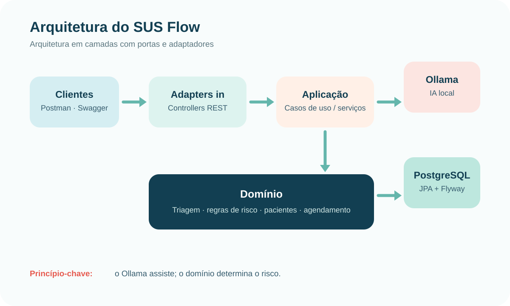
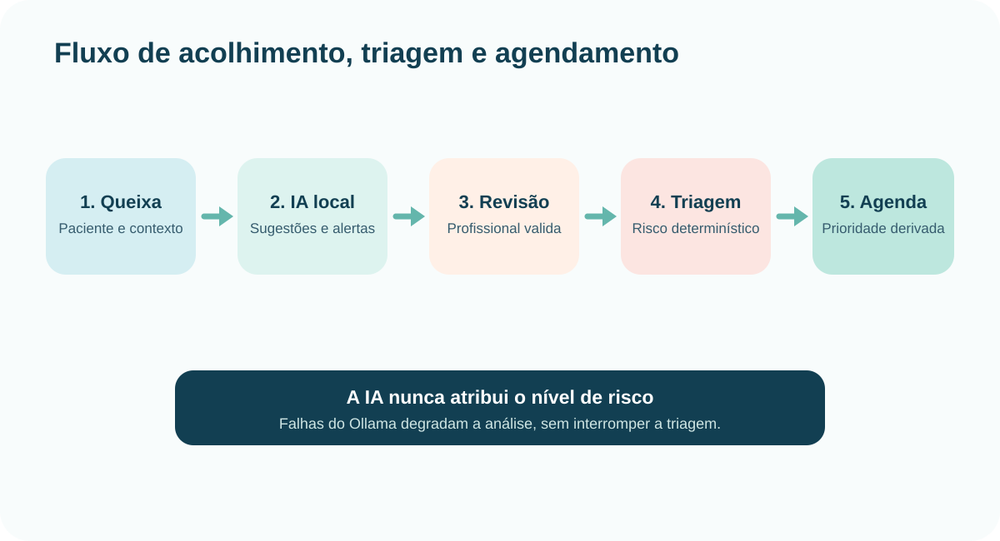

# Relatório do Projeto — SUS Flow

> **Equipe:** Guilherme de Castro Gaspar e Natan Santos Bastos.
> **Repositório:** https://github.com/NAT4N/Hackathon-FIAP
> **Drive público:** https://drive.google.com/drive/folders/1dvwNdy1CPCUqMGdOpzD0D30AG6a6Thgt?usp=sharing
> **Pendente antes da entrega:** incluir os links dos vídeos de pitch e de demonstração do MVP.

## 1. Resumo executivo

O **SUS Flow** é um MVP back-end voltado ao acolhimento, à triagem e ao agendamento de atendimentos no SUS. A solução organiza o fluxo desde o cadastro do paciente até o encaminhamento para consulta ou exame, com classificação de risco baseada em regras determinísticas e assistência por inteligência artificial local.

O diferencial da solução é o uso responsável da IA: o Ollama analisa a queixa em texto livre e devolve sintomas sugeridos, perguntas complementares, alertas de conferência e possíveis campos ausentes. A sugestão é revisada pelo profissional; a classificação de risco não é atribuída pelo modelo de linguagem. Assim, a proposta busca reduzir omissões na coleta de informações sem substituir a autonomia ou a responsabilidade clínica humana.

## 2. Problema identificado

O acolhimento em serviços de saúde exige rapidez e atenção. Profissionais precisam transformar uma queixa livre em informações estruturadas, aferir sinais vitais, identificar sinais de alerta e priorizar o atendimento. Em cenários de alta demanda, dados incompletos e fluxos desconectados podem aumentar o retrabalho e dificultar o encaminhamento adequado.

O escopo do SUS Flow não é resolver integralmente a gestão do SUS. O foco é demonstrar um fluxo técnico para:

1. apoiar a coleta estruturada de dados durante a triagem;
2. tornar a decisão de risco rastreável por regras explícitas;
3. conectar a classificação ao agendamento de consulta ou exame.

### Persona

**Enfermeira de acolhimento em uma UBS/UPA:** atende pacientes com queixas variadas, precisa registrar informações rapidamente e deve confirmar sintomas críticos antes de encaminhar o caso. Ela precisa de apoio que seja rápido, explicável e que não imponha uma decisão clínica automática.

### Hipótese de impacto

Em um piloto controlado, a solução deve ser avaliada pelas métricas de tempo até a classificação, completude dos dados de triagem, quantidade de sugestões revisadas pelo profissional e rastreabilidade do encaminhamento. Não são declarados ganhos clínicos sem validação em campo.

## 3. Descrição da solução

O fluxo principal é composto pelas etapas abaixo:

1. O profissional se autentica com JWT.
2. Um paciente é cadastrado ou consultado.
3. A queixa é enviada ao endpoint de análise assistida.
4. A IA local sugere sintomas e itens para conferência humana.
5. O profissional confirma os dados, informa sinais vitais e registra a triagem.
6. O domínio calcula o nível de risco por regras determinísticas.
7. O atendimento pode ser agendado com prioridade derivada da triagem.

O endpoint `POST /api/triagens/analise` aceita somente a queixa ou, opcionalmente, também sintomas selecionados e sinais vitais completos. A resposta oferece apoio à entrevista e não contém diagnóstico, prescrição ou decisão de risco.

## 4. Processo de desenvolvimento

O trabalho foi estruturado a partir da escolha do tema de triagem e acolhimento inteligente. O processo seguiu estas etapas:

1. **Problema e persona:** delimitação do acolhimento como ponto de dor e definição do profissional de enfermagem como usuário principal.
2. **Ideação:** seleção de um fluxo que combinasse cadastro, triagem e agendamento, em vez de uma solução isolada de chatbot.
3. **Arquitetura:** separação entre domínio, aplicação e adaptadores externos para preservar regras clínicas independentes de IA e banco de dados.
4. **Implementação do MVP:** criação de APIs REST, autenticação JWT, persistência PostgreSQL, migrations Flyway, Docker Compose e integração Ollama.
5. **Validação interna:** testes de domínio, serviços, persistência e adapter Ollama; collection Postman para demonstração ponta a ponta.

## 5. Detalhes técnicos

### Tecnologias

| Camada | Tecnologia |
|---|---|
| Linguagem | Java 21 |
| Framework | Spring Boot |
| API | Spring Web MVC + OpenAPI/Swagger |
| Segurança | Spring Security + JWT |
| Persistência | PostgreSQL + Spring Data JPA + Flyway |
| IA local | Ollama com `llama3.2:3b` |
| Containers | Docker + Docker Compose |
| Qualidade | JUnit, Mockito, Testcontainers e JaCoCo |
| Demonstração | Postman e Swagger UI |

### Arquitetura

O projeto adota organização inspirada em arquitetura hexagonal. Controllers recebem as requisições HTTP; serviços de aplicação orquestram casos de uso; o domínio contém regras de negócio; portas definem contratos; adapters integram persistência e Ollama.

### IA responsável e classificação de risco

A IA é chamada em modo best-effort. Caso esteja desligada ou indisponível, o adapter retorna análise vazia e a triagem segue disponível. O nível de risco é decidido pelo `ClassificadorRiscoService`, usando sinais vitais e sintomas. Portanto, a IA não é a autoridade da decisão de risco.

### Segurança e privacidade

O MVP usa JWT e perfis de acesso. Como próximos passos de produção, recomenda-se autorização por recurso e por unidade de saúde, trilha de auditoria, gestão de consentimento e avaliação de conformidade com a LGPD.

## 6. Links úteis

| Material | Link |
|---|---|
| Repositório | https://github.com/NAT4N/Hackathon-FIAP |
| Drive público da entrega | https://drive.google.com/drive/folders/1dvwNdy1CPCUqMGdOpzD0D30AG6a6Thgt?usp=sharing |
| Vídeo do pitch | **[preencher]** |
| Vídeo do MVP | **[preencher]** |
| Swagger local | `http://localhost:8080/swagger-ui.html` |
| Collection Postman | `postman/Atendimento-SUS.postman_collection.json` |
| Apresentação do pitch | `apresentacao/Pitch-SUS-Flow.html` |

## 7. Aprendizados e próximos passos

### Aprendizados

- IA em saúde deve funcionar como apoio à revisão humana, e não como substituta de avaliação clínica.
- Regras de domínio determinísticas tornam a classificação mais transparente e testável.
- Containers e documentação de API aceleram demonstrações e integração entre os membros da equipe.

### Próximos passos

1. Validar o fluxo com profissionais de uma UBS/UPA em um piloto controlado.
2. Implementar autorização por vínculo entre paciente, profissional e unidade de saúde.
3. Registrar auditoria de sugestões da IA, modelo utilizado, revisão e decisão profissional.
4. Adicionar observabilidade de latência, erros e fallback do Ollama.
5. Evoluir para histórico de atendimentos/prontuário, respeitando requisitos de privacidade e interoperabilidade.
6. Submeter as regras de risco à validação formal de especialistas; o MVP não afirma implementar o protocolo oficial de Manchester.
